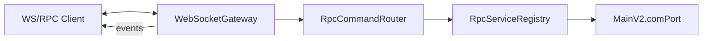

# MpRpc

A [MissionPlanner](https://ardupilot.org/planner/) plugin that exposes a local **WebSocket/RPC** channel to the connected vehicle. An external **WS/RPC Client** connects over websocket and invokes methods on top of the MissionPlanner API.

| | |
|---|---|
| Version | `0.1.0` |
| Endpoint | `ws://127.0.0.1:18081/rpc/` |
| Encoding | JSON (text) or Protobuf (binary) |

## Quick start

1. Build and install the plugin into MissionPlanner (the project is referenced via `MpRpc.csproj`).
2. Launch MissionPlanner and connect to the vehicle.
3. The plugin automatically starts a WebSocket server on `127.0.0.1:18081`.
4. Connect your WS/RPC Client and send a ping:

```json
{
  "id": "1",
  "type": "request",
  "method": "system.ping",
  "encoding": "json",
  "payload": {}
}
```

Response:

```json
{
  "id": "1",
  "type": "response",
  "method": "system.ping",
  "encoding": "json",
  "payload": { "ok": true, "utc": "2026-05-27T15:00:00.0000000Z" }
}
```

## Protocol

Every message is an envelope with the following fields:

| Field | Description |
|---|---|
| `id` | Request correlation id (required for `request`) |
| `type` | `request` · `response` · `event` · `error` |
| `method` | RPC method name |
| `encoding` | `json` or `protobuf` |
| `payload` | Request/response body |

**JSON** — text WebSocket frames (default).  
**Protobuf** — binary WebSocket frames; `telemetry.quick` supports a typed binary payload.

### Errors

On failure the server returns `type: "error"`:

```json
{
  "id": "1",
  "type": "error",
  "method": "error",
  "encoding": "json",
  "payload": {
    "error": { "code": "no-link", "message": "Vehicle is not connected." }
  }
}
```

Error codes: `method-not-found`, `invalid-request`, `invalid-type`, `unsupported-encoding`, `timeout`, `no-link`, `invalid-arg`, `internal-error`.

## API

### System

| Method | Description |
|---|---|
| `system.ping` | Check RPC availability |
| `vehicle.info` | Vehicle/controller identity (firmware, type, version, serial, frame, sysid) |

### Waypoints

| Method | Description |
|---|---|
| `waypoints.read` | Read mission from the vehicle |
| `waypoints.write` | Write mission (`payload.items[]`) |
| `waypoints.setCurrent` | Set the active mission item (`payload.index`, 0 = Home) |

### Parameters

| Method | Description |
|---|---|
| `params.get` | Get a parameter (`payload.name`) |
| `params.set` | Set a parameter (`payload.name`, `payload.value`) |
| `params.list` | List parameters from the MissionPlanner cache |

### Flight mode

| Method | Description |
|---|---|
| `flightmode.set` | Change flight mode (`payload.mode`) |
| `flightmode.list` | List available modes for the current firmware |

### Actions

| Method | Description |
|---|---|
| `actions.exec` | Execute a `MAV_CMD` (`payload.command`, `payload.p1`–`p7`) |

Allowed commands: `DO_SET_HOME`, `DO_SET_SERVO`, `DO_REPEAT_SERVO`, `DO_REPEAT_RELAY`, `DO_DIGICAM_CONTROL`, `MISSION_START`, `DO_TRIGGER_CONTROL`, `DO_SET_RELAY`, `PREFLIGHT_REBOOT_SHUTDOWN`.

### Telemetry

| Method | Description |
|---|---|
| `telemetry.quick` | One-shot telemetry snapshot |
| `telemetry.subscribe` | Enable push stream (`payload.rateHz`, 1–20, default 5) |
| `telemetry.unsubscribe` | Disable push stream |

### MAVLink (mavgen)

Implicit support for any MAVLink message type generated by mavgen. Message type names map to MAVLink enum values (`MAVLINK_MSG_ID`) and C# struct names (`mavlink_{type_lowercase}_t`).

| Method | Description |
|---|---|
| `mavlink.send` | Send any MAVLink message (`payload.type`, `payload.fields`) |
| `mavlink.last` | Read last received packet of a type (`payload.type`) |

After `telemetry.subscribe` the server sends events with `type: "event"`, `method: "telemetry.quick"`:

```json
{
  "type": "event",
  "method": "telemetry.quick",
  "encoding": "json",
  "payload": {
    "timestampUtc": "2026-05-27T15:00:00.0000000Z",
    "mode": "GUIDED",
    "armed": true,
    "lat": 50.45,
    "lng": 30.52,
    "alt": 120.5,
    "groundspeed": 8.2,
    "airspeed": 0,
    "batteryRemaining": 85,
    "batteryVoltage": 12.4,
    "satcount": 14,
    "wpno": 3,
    "roll": 1.2,
    "pitch": -3.4,
    "yaw": 182.0,
    "ch3percent": 55,
    "rpm1": 4200,
    "xtrack_error": 0.8,
    "...": "additional CurrentState fields"
  }
}
```

`telemetry.quick` is built via reflection on MissionPlanner `CurrentState`: scalar properties marked with
`GroupText`, `DisplayText`, or `DisplayFieldName`, plus registered `customfield*` MAVLink fields.
Only `battery_remaining` / `battery_voltage` are aliased to `batteryRemaining` / `batteryVoltage`.
Protobuf encoding still carries the legacy fixed field subset (see `ProtobufCodec`).

## Examples

**Subscribe to telemetry:**

```json
{
  "id": "2",
  "type": "request",
  "method": "telemetry.subscribe",
  "encoding": "json",
  "payload": { "topic": "quick", "rateHz": 10 }
}
```

**Send a MAVLink message:**

```json
{
  "id": "5",
  "type": "request",
  "method": "mavlink.send",
  "encoding": "json",
  "payload": {
    "type": "COMMAND_LONG",
    "fields": {
      "target_system": 1,
      "target_component": 1,
      "command": 400,
      "param1": 1.0
    }
  }
}
```

**Read last received MAVLink packet:**

```json
{
  "id": "6",
  "type": "request",
  "method": "mavlink.last",
  "encoding": "json",
  "payload": { "type": "ATTITUDE" }
}
```

Response:

```json
{
  "id": "6",
  "type": "response",
  "method": "mavlink.last",
  "encoding": "json",
  "payload": {
    "type": "ATTITUDE",
    "found": true,
    "timestampUtc": "2026-06-26T10:00:00.0000000Z",
    "fields": {
      "time_boot_ms": 12345,
      "roll": 0.012,
      "pitch": -0.034,
      "yaw": 1.570,
      "rollspeed": 0.001,
      "pitchspeed": 0.002,
      "yawspeed": 0.0
    }
  }
}
```

**Change flight mode:**

```json
{
  "id": "3",
  "type": "request",
  "method": "flightmode.set",
  "encoding": "json",
  "payload": { "mode": "GUIDED" }
}
```

**Get a parameter:**

```json
{
  "id": "4",
  "type": "request",
  "method": "params.get",
  "encoding": "json",
  "payload": { "name": "WPNAV_SPEED" }
}
```

## Architecture



## Project structure

```
MpRpc/
├── MpRpcPlugin.cs               # plugin lifecycle
├── Transport/WebSocketGateway.cs # WebSocket server and sessions
├── Router/RpcCommandRouter.cs    # request routing
├── Services/RpcServiceRegistry.cs # RPC method implementations
├── Protocol/RpcEnvelope.cs       # envelope model
└── Serialization/                # JSON and Protobuf codecs
```

## v0.1 limitations

- The server binds to `127.0.0.1` only — local access from the same machine.
- No client authentication.
- `vehicle.modeChanged` and `vehicle.connectionChanged` events are not implemented yet.
- Mutating commands (`waypoints.write`, `params.set`, `flightmode.set`, `actions.exec`) require an active MAVLink connection.

## Roadmap

- `vehicle.modeChanged`, `vehicle.connectionChanged` events
- Session token / handshake
- Rate limits for mutating commands
- `protocolVersion` in the protocol
- Protobuf typed payload for additional methods
- Integration tests
